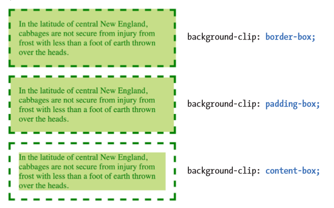
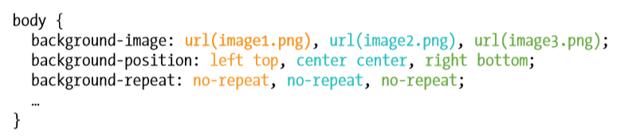
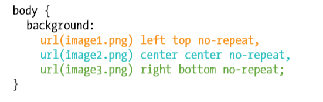
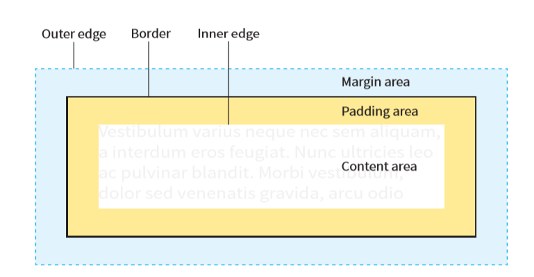

# Intro To Web
* [Description](#description)
* [Part I: Getting Started](#part-I:-Getting-Started)
  * [Getting Started in Web Design](#getting-started-in-web-design)
  * [How the Web Works](#how-the-web-works)
  * [some Big Concepts You Need To Know](#some-big-concepts-you-need-to-know)
* [Part II: HTML for Structure](#part-II:-html-for-structure)
  * [Creating a Simple Page](#creating-a-simple-page)
  * [Marking Up Text](#marking-up-text)
  * [Adding Links](#adding-links)
  * [Adding Images](#adding-images)
  * [Table Markup](#table-markup)
  * [Forms](#forms)
  * [Embedded Media](#embedded-media)
* [Part III: CSS For Presentation](#part-III:-css-for-presentation)
  * [Introducing Cascading Style Sheets](#introducing-cascading-style-sheets)
  * [Formatting Text](#formatting-text)
  * [Colors and Backgrounds](#colors-and-backgrounds)
  * [Thinking Inside The Box](#thinking-inside-the-box)
* [Further Reading](#further-reading)

# Description
Notes and projects following along to the book [Learning Web Design by Jennifer Robbins](https://www.amazon.com/Learning-Web-Design-Beginners-JavaScript/dp/1449319270)

# Part I: Getting Started
## Getting Started in Web Design
* Website creation roles
  * Content Wrangling
    * [Information architecture](#information-architecture): organizes content for ease of findability. 
    * [Content strategy](#content-strategy): Makes sure all text supports the brand identity
* Design: 
  * [UX and UI](#ux-and-ui)
    * First, design how the site works, the goal, how visitors move through it.
    * Goal: make site as easy efficient and delightful to use as possible
    * User research and testing reports: helps understand the needs, desires, and limitations of users
    * User testing is usually done at each phase of the design process
    * Wireframe Diagrams: shows structure of webpage, indicates how screen real estate is split up (omits colors, fonts, etc)
    * Site Diagram: indicates structure of site as a whole, how individual pages relate to one another
    * Storyboards and user flow charts: traces a users path through the site
  * Visual (graphic) design
    * Creates the “look and feel” of the site
    * Mock-ups (created in Photoshop - esque software) are used to present a visual design to clients and stakeholders
    * Since sites appear on different screen sizes, designers prefer to discuss visual identity (colors, fonts, image style, etc) that’s not tied to a desktop view (ex: style tiles or element collage)
* Code Slinging
  * Frontend development
    * Authoring/Markup (HTML) - authoring prepares content, marks up the content with HTML tags that describe the content and its function
    * Styling (CSS) - Describes how the content should look, also allows creation of responsive design
    * [JavaScript](#javascript) and DOM scripting - adds interactivity to web pages
      * AJAX (asynch JS and XML) is also important to know
  * Backend Development
    * Focus on the server, apps and databases (forms processing, content management systems, etc.)
    * Need server-side programming languages (PHP, Ruby, .NET, Python, or JSP)
    * Need to know how to work with databases (mySQL, Oracle, SQL server)
* Other Roles: product manager, project manager, SEO specialist, multimedia producers
## How the Web Works
Internet vs Web
* Internet is an international network of connected computers. The purpose is to share information
  * There are protocols in place to standardize how we transfer data
* Web (World Wide Web) is a means of information transfer
  * Uses the HTTP protocol (aka HyperText Transfer Protocol)
Servers - software on a computer that allows computers to communicate
* Servers wait for request for info, and then retrieve and send that info back
  * Servers often use Apache server software
IP address (Internet Protocol) and DNS (domain Name System)
* IP address - Assigned to every device connected to the internet
* DNS - allows humans to easily identify an internet-connected device.
  * Think of DNS like a pointer to an IP address
Web addresses (URLs)
* URL is made up of the protocol, the site name, the absolute path to the document/resource
  * http:// is the protocol
  * www (hostname) . example . com (domain name) (all together is the name of the site)
  * /2018/samples/first.html (directory path + document) (all together is the absolute path)
## Some Big Concepts You Need to Know
[Progressive enhancement](#progressive-enhancements) - allows you to deal with the ever evolving web technologies
* Design the minimum requirements, then add improvements for the enhanced devices
* Make sure basic functionality works without JavaScript
Responsive Web Design - provides appropriate layouts to devices based on the size of the viewport
# Part II: HTML for Structure
## Creating a Simple Page
Basics of page production
1. Start with content - write up raw text content
2. Give the document structure -  Add HTML elements in
3. Identify text elements - describe the content using appropriate HTML
4. Add images
5. Add CSS

Basic HTML document structure
```
<!DOCTYPE html>
<html>

    <head>
        <meta charset="utf-8">
        <title>Titlehere</title>
    </head>

    <body>
    Page content here
    </body>

</html>
```
* `charset="utf-8"` defines the document as using unicode
* What is the DOM (Document Object Model)
  * The relationships created between the elements (exemplified through the HTML markup and nesting)
* Block elements and inline elements are treated differently in the browser
* Empty elements (ex: ``) have no content
* Attributes have syntax
  * `attributename="value"`
* Validatig a document means to check that the markup follows HTML standards
## Marking Up Text
* Assign an element to all the text in the document
* Use `<hr/>` to indicate that one topic has completed and another one is beginning
  * DON'T use `<hr/>` as a decorative line. Use CSS for that instead.
* Lists
  * For ordered lists, you can specify the list start at a number other than 1 using the `start` attribute (ex: `<ol start="17">`)
  * Description lists are used for name value pairs (terms and definitions, questions and answers)
  * `dl` element is allowed to contain only `dt` and `dd` elements
  * `dt` elemnts can have multiple `dd` elements; and `dd` elements can contain any type of flow content
```
<p> We illustrate a description list below: </p>
<dl>
    <dt>This is a term</dt>
    <dd>This is a definition</dd>

    <dt>Another term </dt>
    <dd>Another definition</dd>
</dl>
```
```
<dl>
    <dt>This is a term</dt>
    <dd>This is a definition</dd>
    <dd>This is a second definition</dd>

    <dt>Another term </dt>
    <dd>Another definition</dd>
    <dd><p>A second definition</p>
        <p>This time with paragraphs</p>
    </dd>
</dl>
```
* Longer Quotations, use `<blockquote></blockquote>`
  * Content within `<blockquotes>` should be contained in other elements
```
<blockquote>
    <p>Notice that this text is in a paragraph element.</p>
</blockquote>
```
* Preformatted text, `<pre></pre>` used when character spacing is semantically significant (ex: poems)
* Figures `<figure></figure>` identifies content that illustrates or supports some point in the text
  * `figure`s may contain images, video, code, text, or a table
  * `<figcaption></figcaption>` allows you to add a caption either above or below the `figure`
```
<figure>
    <pre>
        <code>
            body {
                background-color: #000;
                color: red;
            }
        </code>
    </pre>
</figure>

<figcaption> An example of how to use figure and pre HTML elements. </figcaption>
```
* Organzing Page Content (main, header, footer, section, article, nav, aside, and address)
  * Main content `<main></main>` - identifies the primary content of a page or application
    * The content of a `main` element should be unique to that page. No sidebars, headers, etc. 
    * Each page should have only one `main` and it should not be nested within an `article`, `aside`, `header`, `footer`, or `nav`
    * `main` can and should include other elements within it.
  * Headers and Footers `<header></header>` `<footer></footer>`
    * headers and footers can include any elements 
    * you cannot, however, next other `header`s or `footer`s within them
    * you can create multiple `footer`s in a page, setting a `footer` for other sectioning elements (`section`, `article`, etc)
  * Sections and Articles `<section></section>` `<article></article>`
    * if the content is self contained use `article` instead of `section`
    * if the grouping of the elements is simply to provide a hook for styling, use the generic `div` element
  * Aside (sidebars) `<aside></aside>`- tangentially related material
    * Can include other elements within (think of a side bar with links and lists)
  * Navigation `<nav></nav>` - identifies primary navigation for a site
    * Can include other elements within it (ex: containing a `ul` in `nav` element)
  * Addresses `<address></address>` - used to create an area for contact info
    * generally placed at the end of the document
* Inline Elements
  * For `abbr` element, the `title` attribute provides the unabbreviated version or in the case of acronyms, the full title
    * `<abbr ttile="Points">pts.</abbr>`
    * `<abbr title="American Type Founders">ATF</abbr>`

* Generic Elements `<div></div>` and `<span></span>`
  * `div` indicates a division of content, you may be able to use `section` now instead
  * `span` same as `div` but used for phrases/words
  * you can give these elements meaning/context with `id` and `class` attributes
  * the `id` attribute - assigns a <em>unique</em> identifier to an element, the value of `id` must be used only once in the document
  * the `class` attribute - classifies elements into conceptual groups, can be shared by multiple elements
* Escape characters - using characters reserved for HTML (ex: <)
  * use the named entity & lt; or its numeric equivalent & #060;
## Adding Links
* To add a link, place content between `<a></a>` anchor tags. 
  * `href` attribute allows you to specify which document to link to
    * if Linking to a page on the web, you MUST provide the protocol (ex `http://`)
* Relative pathnames
  * You can have pathnames relative to the document that contains the link OR you can have pathnames that start at the root directory
  * A root directory starts from the root directory by using `/` at the start of the pathname
    * Because this type of link starts at the root, it works from any document on the server, regardless of which subdirectory it is located in
* Linking to a specific point in a page
  * This is known as linking to a document fragment.
  * First assign the target element in the document a unique `id`. This is a Fragment Identifier 
  * Then create a link using `<a href="#uniqueId">Link to unique element</a>`.
* Linking to a fragment in another document
  * Do this by adding the fragment name to the end of the URL
  * `<a href="index.html#uniqueId">Link to a fragment in another document.</a>`  
* Opening links in a new browser window
  * use the `target` attribute in the anchor element. Set the value of target to `_blank` to open a new window upon click
  * you can also name the target window such as "display" or "newWin" as long as the name does not start with an underscore. If you set `target="display"` for all your links, all the links will open up in the same window
* Putting email in html allows spambots to target your email. Consider encrypting the address using JavaScript
* Telephone Links - this allows mobile users to directly call
  * Use the `tel: ` protocol (ex: `<a href="tel: +01-800-555-2121">Call us!</a>`) Be sure to include the international country code
  * You could then use CSS to hide the link for non-mobile devices 
## Adding Images
* Images that appear as decoration (in the background of the header or a patterned border around an element) should be added through CSS
* Images that are part of the content appear in HTML
* The `src` and `alt` attributes are required for images
  * `alt` provides alternate text to display if the image is not available
  * the value of `alt` can be `null`
* Take advantage of caching for less trafic for the server
  * The browser downloads an image and stores it in the disk cahce. If an image is used repeatedly, be sure the `src` attribute for each image points to the same URL on the server, this allows the server to just use the cache.
* SVG images - vector based images
  * They are in text so they are faster to download than bitmapped images
  * resizing of vectors allows for responsive layout
  * Allows for animation
  * You can easily add interactivity with JavaScript
  * you may need to add server support for SVG images
* SVGs can be embedded with the `img` element
  * ``
  * If you do this, you cannot apply style to the SVG or add interactivity
* Using the SVG inline
  * Downside: inline SVG is not cached by the server
```
<p>This summer, try making pizza
 
<svg xmlns="http://www.w3.org/2000/svg" viewBox="0 0 72 72" width="100" height="100">  
    <circle fill="#D4AB00" cx="36" cy="36" r="36"/>  
    <circle opacity=".7" fill="#FFF" stroke="#8A291C" cx="36.1" cy="35.9" r="31.2"/>  <circle fill="#A52C1B" cx="38.8" cy="13.5" r="4.8"/>  <circle fill="#A52C1B" cx="22.4" cy="20.9" r="4.8"/>  
    <circle fill="#A52C1B" cx="32" cy="37.2" r="4.8"/>  <circle fill="#A52C1B" cx="16.6" cy="39.9" r="4.8"/>  
    <circle fill="#A52C1B" cx="26.2" cy="53.3" r="4.8"/>  
    <circle fill="#A52C1B" cx="42.5" cy="27.3" r="4.8"/>  
    <circle fill="#A52C1B" cx="44.3" cy="55.2" r="4.8"/>  
    <circle fill="#A52C1B" cx="54.7" cy="42.9" r="4.8"/>  
    <circle fill="#A52C1B" cx="56" cy="28.3" r="4.8"/> 
</svg>

 on your grill.</p>
```
* Embedding SVG with the `<oblject></object>` element
  * The `object` tag specifies the media type and points to the file using the `data` attribute
  * If the `data` cannot be displayed any content within the `object` tags gets rendered
```
<object type="image/svg+xml" data="pizza.svg">
    
</object>
```
  * HOWEVER, some browsers download both the SVG as well as the content. We can circumvent this by using a `div` and CSS within the `object` tag
```
<object type="image/svg+xml" data="pizza.svg">
    <div style ="background-image: url(pizza.png); width 100px; height: 100px;" role="img" aria-label="pizza">
</object>
```
* Using SVGs as background images with CSS
  * Setting the background image of the header to an SVG
```
header {
    background-image: url(/images/decorative.svg);
}
```
* Responsive Images - you provide multiple images and the browser decides which is most appropriate
  * `srcset` - attribute for `img` tag, it allows developers to specify a list of image source options for the browser to choose from
    * The value of `srcset` is a comma-separated list of options, where each item in the list has the URL of an image and an `x-descriptor` that specifies the target device pixel ratio
    * ``
    * The `src` attribute is still required to specify the default image for 1x pixel ratio
    * HOWEVER, x descriptors select an image w/o regard for dimensions of the viewport. So x descriptors should be used for images that stay the same pixel dimensions regardless of the screen size (ex: logos, social media badges, etc)
  * Programming in response to viewport size
    * `w-descriptor` attribute provides the pixel width of each image (ex: `srcset="strawberries-480.jpg 480w, strawberries-960.jpg 960w:`)
    * `sizes` attribute tells the browser the approximate size that the image will appear in the page's layout, in terms of the % of the viewport width. `sizes` MUST be used if `w-descriptor` attribute is used.
      * It is measured in `vw` units, viewport width units.
```

```
  * In other cases, `sizes` attribute can be used to tell the browser to size images differently depending on the viewport width. There are then 2 conditions for using `sizes` in this manner
  1. `media condition` describes a parameter, ussually the width of the viewport. This is placed in parentheses
  2. the length that indicates the width that image will occupy in the layout if the first condition is met, measured in `vw` units.
```

```
* Art Direction - Allows you to display a cropped image on a smaller screen size.
  * Done with the `<picture></picture>` element wrapped around `source` and `img` elements.
  * The `img` attribute MUST be last.
  * The `source` element can also take the `sizes` attribute
```
<picture>
    <source media="(min-width: 1024px)" srcset="icecream-large.jpg"/>
    <source media="(min-width: 760px)" srcset="icecream-medium.jpg"/>
    
</picture>
```
* It is also possible to use the `<picture></picture>` element to provide more efficient image formats (ex: WebP, JPEG XR) to browsers that support them.
```
<picture>
    <source type="image/webp" srcset="pizza.webp"/>
    <source type="image/jxr" srcset="pizza.jxr/>
    
</picture>
```
## Table Markup
<table>
    <tr>
        <th>Table Header</th>
        <th>Table Header</th>
    </tr>
    <tr>
        <td>table data</td>
        <td>table data</td>
    </tr>
</table>

```
<table>
    <tr>
        <th>Table Header</th>
        <th>Table Header</th>
    </tr>
    <tr>
        <td>table data</td>
        <td>table data</td>
    </tr>
</table>
```
* The number of `<tr></tr>`tags denote the number of table rows
* The number of columns is denoted by the number of `<th></th>` tags
* `colspan` and `rowspan` attributes allow a `th` or `td` span multiple rows or columns
  * the `rowspan` attribute should appear in the row of which the span starts
<table>
    <tr>
        <th rowspan="2">Serving Size</th>
        <td>Small (8oz.)</td>
    </tr>
    <tr>
        <td>Medium (16oz.)</td>
    </tr>
</table>


```
<table>
    <tr>
        <th rowspan="2">Serving Size</th>
        <td>Small (8oz.)</td>
    </tr>
    <tr>
        <td>Medium (16oz.)</td>
    </tr>
</table>
```

* to improve accessibility - use `<caption></caption>` to add captions to tables
  * The `caption` must be the first thing within the `table` element
* Rows can be grouped together using `<thead></thead>`, `<tbody></tbody>`, and `<tfoot></tfoot>`
* Cols can be grouped together using `<colgroup></colgroup>` tag immediately after the `caption`element. 
  * `<colgroup>` elements are empty and are simply used to tell the browser the structure of the table
  * the `span` attribute can be used within `colgroup` to indicate the number of columns in a `colgroup`
  * Alternatively, you can identify individual columns within a `colgroup` using the `<col>` element and add a `class`
```
<table>
    <caption></caption>
    <colgroup></colgroup>
    <colgroup>
        <col class="start" />
        <col class="end" />
    </colgroup>
    <colgroup>
        <col class="start" />
        <col class="end" />
    </colgroup>
    <!-- rest of the table.. -->
</table>
```
## Forms
* `<form></form>` element is used as a container for form control elements. Specific attributes to the `form`
  * `action` - provides the location (URL) of the application or script that will process the form - ussually link to some script written in some scripting language (PHP, Ruby on Rails, Python, etc)
  * `method` - indicates how the data will be sent to the server (indicated by `POST` or `GET`)
    * `GET` - the data gets tacked into the URL
    * `POST` - sends the data to the server separately. This is more secure
* Different form control elements allow the user to enter info and choose between options
  * `name` attribute - provides the variable name for the control. The name should correspond to the variable names that you will be using server-side
* Text Entry Controls
  * Single line text field - in the `input` element, set the `type` attribute to `"text"` (Ex: `<input type="text" />`)
    * `value` attribute - specifies default text that appears in the field. If the user does not over write, this will be sent to the server
    * `placeholder` attribute - provides text that appears in the field but is not sent to the server
    * `maxlength`, `minlength` attribute - specifies number of characters a user can input
  * Multiline text-entry field - use the `<textarea></textarea>` element
    * the content between `textarea` tags appears in the text box when the form is desplayed
    * `rows` and `cols` attributes can be used to specify the size of the `textarea`
* `disabled` and `readonly` attributes can be applied to form control to prevent users from interacting with it. `disabled` forms are not sent to the server, but `readonly` ones are.
  * `disabled` inputs can be toggled on and off w/ JavaScript
* Specialized text-entry fields
  * Password entry field - `<input type="password />` - This does not actually encrypt the data
  * search - `<input type="search"/>`
  * email - `<input type="email/>`
  * telephone - `<input type="tel">`
  * URL - `<input type="url">`
* Drop down Suggestions can be provided using `<datalist></datalist>`
  * within the `datalist` element, the drop down items are marked as `<option value="option name" />` elements, where the `value` attribute gives the name of the options
  * within the `input` element, the `list` attribute should be used to associate the `input` with the respective `id` of the `datalist`
  * Some browsers don't support datalist. JavaScript can be used to create a datalist.
  * `datalist`provides options, but user can still type response

```
<input type="text" list="edulevel" name="education" />
<datalist id="edulevel">
    <option value="High School"/>
    <option value="Bachelors Degree"/>
</datalist>
```

* Buttons
  * Submit button - `<input type="submit"/>` sends the data in the form to the server
  * Reset button- `<input type="reset" />` resets the data in the form
  * Image button - `<input type="image" />` replaces the submit button with an image of your choice
  * Custom input button - `<input type="button">` these can be customized with JavaScript
* Radio buttons - `<input type="radio" name="variable" value="value"/>`
  * only one radio button within a group can be selected at once
  * use the `name` attribute to group radio buttons
  * the `checked` attribute checks the radio button when the form initially is loaded
<form>
<ul>
    <li><input type="radio" name="yes_no" value="yes" checked /> Yes </li>
    <li><input type="radio" name="yes_no" value="no"/> No</li>
</ul>
</form>

```
<form>
<ul>
    <li><input type="radio" name="yes_no" value="yes" checked /> Yes </li>
    <li><input type="radio" name="yes_no" value="no"/> No</li>
</ul>
</form>
```

* Checkbox buttons -`<input type="checkbox" name="variable" value="value" />`
  * multiple checkboxes can be checked
  * a checkbox can also use the attribute `checked`
* Menus - `<select></select>` - within the `select` element, `<option></option>` elements provide the options for the menu
  * adding `selected` attribute to an option makes it preselected
  * Drop-down menu - the default menu
    * only one option can be picked
    * you can choose to define the `value` using the attribute. Otherwise, the content in the `option` element will be sent as the `value`
  * Scrolling menu - defined by adding the `size` attribute - this indicates the number of options shown
    * Adding the `multiple` attribute allows user to choose multiple options
* Menu options can be grouped together using `<optgroup label="label"/>`

```
<select name="icecream" size="4">
    <optgroup label="traditional>
        <option> vanilla </option>
        <option> chocolate </option>
    </optgroup>
    <optgroup label="fancy">
        <option> Praline </option>
        <option> Birthday Cake </option>
    </optgroup>
</select>
```
* File Selection - `<input type="file"/>`
  * in the `form` tag you must include the `enctype="multipart/form-data"`, encoding type, attribute
* date and time controls - `<input type="date"/>`, `<input type="time"/>`
* Numerical inputs - `<input type="number"/>`, `<input type="range"/>`
  * Range input provides a slider, usually
  * `min`, `max`, and `step` attributes can be added. Step defines the 'steps' or interval between each number
* Color selector - `<input type="color" />`
* Accessibility
  * Labels - `<label></label>` are used to link the form control elements with the associated text. 
    * `explicit association` matches the label with the control's `id` reference using the `for` attribute in the `label` element
    * `implicit association` is done by wrappin the form element and the text in the `label` element w/o extra attributes
```
<ul>
    <li><label>
        <input type="checkbox" name="genre" value="punk" /> Punk
    </label></li>
</ul>
```

```
<ul>
    <li>
        <label for="form-username"> Login account </label>
        <input type="text" name="login" id="form-username" />
    </li>
</ul>
```
* fieldsets - `<fieldset></fieldset>` can also be used to logically group different parts of the form; however, styling may be more difficult due to sketchy browser support
## Embedded Media
* iframe - `<iframe src="URL to embedded content">...</iframe>` shows a window within the current window
  * `height` and `width` attributes specify the size of the embedded window
  * the content within the `iframe` element is shown in the case that the browser doesn't support `iframe`
  * the `sandbox` attribute can be used to restrict iframes from having pop-ups
* videos with `<video src="location of the vid" width="width" height="height" poster="some image"></video>`
  * the `poster` attributes assigns the thumbnail of the video
  * `autoplay` attribute can set the video to play automatically
  * `controls` attribute prompts the browser for controls to pause/play etc the video
  * you can provide multiple video options using `<source src="" type="video/mp4 or video/webm, etc"/>`, similarly to how images use `srcset` to provide multiple images.
  * the content within the `video` element will load if the browser does not support `video`
* Audio can be added using `<audio></audio>`
  * Similarly you can add multiple audio files using the `<source src="" type="audio/mp3" />` element
  * the content within the `audio` element will load if the browser does not support `audio`
* `canvas` can be used to programatically add images and animations
  * this is done using the `<canvas></canvas>` element
  * the content within the `canvas` element will load if the browser does not support `canvas`
# Part III: CSS for Presentation
## Introducing Cascading Style Sheets
* when styling elements, the style is also applied to the children elements (inheritance applies)
* when two style rules disagree, the selector with higher specificity overrides
  * a rule can be marked `!important`, this will override all other style rules
* CSS Units
  * `em` unit of measure based on the size of an 'm' in the current font (this changes depending on the size of the element you are applying it to)
  * `rem` unit of measure based on the size of an 'm' in the `root` element of the HTML file (this is constant)
  * `vw` - viewport width, equal to 1/100 of the current viewport width
  * `vh` - viewport height, equal to 1/100 of the current viewport height
   (Thus if you want an image to take up half the height of the screen, set the height to `50vh`)
## Formatting Text
* font name - `font-family` property
  * Values: one or more font or generic font family names separated by commas
  * fonts should be capitalized, font families can be lower case
  * fonts w/ spaces in the name should be surrounded by ""
```
font-family: "Duru Sans", Verdana, sans-serif;
```
* the 5 font families
  * Serif - has decorative strokes
  * sans-serif - has straight strokes
  * monospace - each letter has equal spacing
  * cursive
  * fantasy - purely decorative
* You can include online fonts by embedding them in the `head` of the HTML document using the `<link />` element and including the link to the font file.
```
<head>
    <link href="http://fonts.googleapis.com/css?family=Marko+One" 
            rel="stylesheet" />
    <style>
        body {
            font-family="Marko One", Georgia, serif;
        }
    </style>
</head>
```
* Font size - `font-size` property specifies the size of the font
  * values: length unit | percentage | small | medium | large | smaller | larger
  * when using CSS length units (`em`, `rem`, %) be sure there is no space between the number and the unit
  * relative values (`rem`, `em`, %) - are computed in relation to their parent's font size.
* font weight - `font-weight` property makes text bold
  * values: normal, bold, bolder
* font style - `font-style` property italicizes text
  * values: normal, italic, oblique (browsers render italic and oblique the same)
* font Variant - `font-variant` property creates small caps
  * values: normal, small-caps
  * <p style="font-variant:small-caps;">small-caps</p>
* font stretch - `font-stretch` property stretches or condenses the spacing between letters
  * values: normal, condensed, expanded
* `font` shorthand property
  * must contain `font-size` and `font-family` values. All other potential values must appear before these two.
```
<style>
    h1 { font: bold, 1.5em, Georgia, serif; }
</style>
```
* Selector types
  * Element selector `p { color: navy: }`
  * Grouped selectors `p, ul, td, th { color: navy; }`
  * Descendant selectors - target elements that are contained within (thus are descendants of) another element. 
    * A space between element names indicates the second element is a descendant of the first
    * `li em { color: green; }`
  * ID selectors - select an element based on the id given to it - indicated using the '#'
    * `#nav { color: white; }`
  * Class Selectors - selects an element based on the class name - indicated using '.'
    * placing an element in front of the '.class' indicates only those elements of the class that are found in that element (ex: `p.special {color: orange; }`)
    * `.special { color: orange; }`
* Text Color - `color` property allows you to change the color of the text
  * values: color value (name or numeric)
* line-height - `line-height` property defines the minimum distance from baseline to baseline in text
  * values: number, length measurement, percentage
  * providing a number acts as a scaling factor, multiplying by the current font size. It is inherited as a factor
  * providing a length measurement, causes the value to be inherited as a calculated measurement. Percentages are inherited similarly
* Indents - `text-indent` property indents the first line of the text
  * Values: length measurement, percentage
  * the percentage is calculated based on the width of the parent element
  * negative measurements are permitted (this creates hanging indents)
* horizontal text alignment - `text-align` property aligns the text
  * Values: left, right, center, justify, start
  * Start, starts at left for languages that read left to right; and starts at right for languages that read right to left
* Underlines and decorations - `text-decoration` 
  * values: none, underline, overline, line-through
* Changing capitalization - `text-transform`
  * values: none, capitalize, lowercase, uppercase
  * capitalize, capitalizes each word
* spaced out - `letter-spacing` property inserts space between letters and `word-spacing` property inserts space between words
  * values: length measurement, normal
* text shadow - `text-shadow` property adds a shadow
  * values: 'horizontal offset' 'vertical offset' 'blur radius' 'color'
* Bullet Points
  * Choosing a marker - `list-style-type`
    * Values: none, disk, circle, square, decimal-leading-zero, etc.
    * the disk is the standard bullet point. Circle is an empty circle
  * Marker position - `list-style-position` property allows you to place the bullet points inside or outside the content area box
    * Values: inside, outside
  * Make your own bullets - `list-style-image`
    * Values: url(location), none
    * you provide the location of the image that will become bullet points
```
ul {
    list-style-type: disk;//this is set as backup
    list-style-image: url(images/rainbow.gif);
    list-style-position: outside;
}
```
## Colors and Backgrounds
* you can define colors with the `color` property
  * Values: color names, RGB
  * This changes the foreground color, the color of the text and border
* `background-color` - changes the background color
  * values: color value (name or numeric)
* Clipping the background, the background painting area extends to the outer edge of the border as the default
  * `background-clip` property
    * values: border-box, padding-box, content-box


* opacity - you can change the opacity of an element, (both text and background) using the `opacity` property
  * values: number (from 0 to 1)
* Pseudo-class selectors: indicated by the colon (:) and goes immediately after an element name (ex: `li:first-child`)
  * Pseudo classes are applied as the result of the user interacting with the page
  * `:link` - applies when the element is an unclicked link
  * `:visited` - applies when the element has already been clicked
  * `:focus` - applies when the element is selected and ready for input
  * `:hover` - applies when the mouse pointer is over the element
  * `:active` - applies when the element is in the process of being clicked or tapped
  * required order for pseudo-classes: an order is requried because the last pseudo class overrides the previous ones
    * link, visited, focus, hover, active
* Pseudo-element selectors - indicated by a double colon (::) and goes immediately after an element name
  * `::first-line` - applies to the first line of a paragraph
  * `::first-letter` - applies to the first letter of a paragraph
* Generate content with `::before` and `::after` pseudo element selectors
  * `content` is a required property
    * values for `content` property: `url(image.png)` and `"text content"`
    * `url(image.png)` - allows you to generate an image
    * `"text content"` - allows you to generate text
```
<head>
    <style>
        p.warning::before {
            content: url(exclamation.png);
        }
        p.warning::after {
            content: "Thank you";
            color: red;
        }
    </style>
</head>
<body>
    <p class=w"warning"> We are requried to warn you... </p>
</body>
```
* Attribute Selectors - target elements based on attribute names or values
  * `element[attribute]` - targets elements with a particular attribute regardless of its value
  * `element[attribute="exact value"]` - targets elements with a particular attribute with this specific value
* Background Images - allows you to place a background image in the back of an element.
  * `background-image` - property adds a background image to any element
    * values: url(location of image), none
    * always specify a similar `background-color` in case the `background-image` fails to load - if both are specified, the `background-color` only loads if the `background-image` doesn't load
  * `backgroud-repeat` - allows you to change the way the background repeats
    * values: repeat, no-repeat, repeat-x, repeat-y, space, round
    * `repeat-x` - restricts the image to tiling only horizontally
    * `repeat-y` - restricts the image to tiling only vertically
    * `space` - the browser calculates how many background images can fit across the width and height of the background area then adds equal amounts of space between each image
    * `round` - the browser squishes the background image horizontally and vertically to fit in the background area an even number of times
  * `background-position` - specifies the position of the origin image in the background
    * values: length measurement, percentage, left, center, right, top, bottom
  * `background-origin` - allows you to change the location of where the image is placed, similar to `background-clip`
    * values: border-box, padding-box, content-box
  * `background-attachment` - changes the way the background scrolls with the content
    * values: scroll, fixed, local
  * `background-size` - allows you to change the size of the image
    * values: length, percentage, auto, cover, contain
  * shorthand background property - `background`
    * values: background-color background-image background-repeat background-attachment background-position background clip background-origin background-size
    * these values can appear in any order
  * multiple backgrounds - put these backgrounds in a list separated by commas 
    * the image lsted last goes on the bottom, and each image prior in the list layers on top of it



* Gradients - can be applied anywhere an image may be applied (`background-image`, `border-image`, etc), where the `background-image` is the property and the gradient is the value
  * `linear-gradient(deg, begining-color, optional-middle-colors, ending-color)`
    * `deg` - the degree on which the gradient occurs (ex: 180 or 90)
    * `background-image: linear-gradient(54deg, red, orange, yellow, green, blue 50%);`
    * the `blue 50%` indicates that blue starts 50% of the way through the gradient
  * `radial-gradient(begining-color, optional-middle-colors, end-color)`
  * repeating gradients: `repeating-linear-gradient()`or `repeating-radial-gradient()`
* External Style Sheets
  * import CSS style sheets into HTML documents using `<link rel="stylesheet" href="stylesheet.css"/>`
  * you can import CSS into CSS files using `@import url("stylesheet.css");`
  * modular style sheets - allow you to keep styles that you frequently use (typography treatments, forms, layout rules, etc) in separate style sheets and then combine them using `@import`
## Thinking Inside The Box


* Specifying box dimensions
  * `width`: length, percentage, auto
  * `height`: length, percentage, auto
  * `box-sizing`: content-box, border-box
    * `box-sizing` determines how the height and width are applied to the box
    * `content-box` applies the height and width to the content and does not include the padding and borders
    * `border-box` applies the height and width to the content as well as the borders and padding
```
/* This sets all the box-sizing in the page to border-box */
html {
  box-sizing: border-box;
}
* {
  box-sizing: inherit;
}
```
* `overflow` - handles overflow
  * values: visible, hidden, scroll, auto
* padding is the space between the content area and the border
  * `padding-top`, `padding-right`, `padding-bottom`, `padding-left` properties
    * values: length, percentage
  * `padding` is the shorthand property
    * values: length, percentage
    * 4 values: top right bottom left
    * 3 values: top left/right bottom
    * 2 values: top/bottom left/right
    * 1 value: applies to all sides
* Borders
  * `border-top-style`, `border-right-style`, `border-bottom-style`, `border-left-style`; shorthand property is `border-style`
    * values: none, solid, hidden, dotted, dashed, double, groove, ridge, inset, outset
  * `border-top-width`, `border-right-width`, `border-bottom-width`, `border-left-width`; shorthand property is `border-width`
    * values: length, thin, medium, thick
  * `border-top-color`, `border-right-color`, `border-bottom-color`, `border-left-color`; shorthand property is `border-color`
    * values: color name/value, transparent
  * `border`, `border-top`, `border-right`, `border-bottom`, `border-left` shorthand property; combines style, width and color
    * values: border-style border-width border-color
  * `border-radius` allows creation of rounded corners; this can also be altered to create elliptical corners
    * values: length, percentage
* Margins - an optional amount of space you can add to the outside of the border; prevents elements from bumping into one another or the edge of the browser
  * `margin-top`, `margin-right`, `margin-bottom`, `margin-left`, `margin`
    * values: length, percentage, auto
    * be wary of collapsing margins (when margins overlap)
    * you can also have negative margins
* display types - `display`
  * values: inline, block, run-in, flex, ..., none
* `box-shadow` - property creates shadows around an element box, similar to `text-shadow`
  * values: 'horizontal offset' 'vertical offset' 'blur distance' 'spread distance' color inset|none


# Further Reading
### Information Architecture
* Information Architecture: For the Web and Beyond, by Louis Rosenfeld and Peter Morville (O’Reilly).

### Content Strategy
* Content Strategy for the Web, 2nd Edition, by Kristina Halvorson and Melissa Rich (New Riders)

### UX and UI
* The Elements of User Experience: User-Centered Design for the Web and Beyond by Jesse James Garrett (New Riders) 
* Don’t Make Me Think, Revisited: A Common Sense Approach to Web Usability by Steve Krug (New Riders)
* The Design of Everyday Things by Don Norman (Basic Books) 
* About Face: The Essentials of Interaction Design, 4th Edition by Alan Cooper, Robert Reimann, David Cronin, and Christopher Noessel (Wiley) 
* Designing Interfaces, 2nd Edition by Jenifer Tidwell (O’Reilly)
* 100 Things Every Designer Needs to Know about People by Susan Weinschenk (New Riders) 
* Designing User Experience: A Guide to HCI, UX and Interaction Design by David Benyon (Pearson)

### JavaScript
* Learning JavaScript by Ethan Brown (O'Reilly)

### Progressive Enhancements
* Adaptive Web Design: Crafting Rich Experiences with Progressive Enhancement, 2nd Edition, by Aaron Gustafson (New Riders). 
* The Uncertain Web: Web Development in a Changing Landscape by Rob Larson (O’Reilly). 
* Designing with Progressive Enhancement by Todd Parker, Patty Toland, Scott Jehl, and Maggie Costello Wachs (New Riders)
